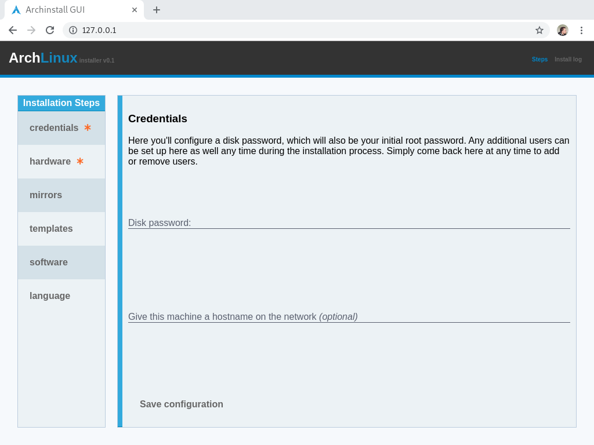

# archinstall_gui
Graphical [Arch Linux](https://wiki.archlinux.org/index.php/Arch_Linux) installer.<br>
All **errors should be reported here**, and no where else.<br>
See trouble-shooting a bit further down.

> **Note**: If you're not familiar with Arch Linux or the installation process, please have a look at the comprehensive [Installation Guide](https://wiki.archlinux.org/index.php/Installation_guide). Arch Linux **does not** come default with a graphical desktop environment.

# Demo / Screenshot

[A video demonstration](https://youtu.be/btdCE-u5n8U)


# Pre-built Live ISO:

A pre-built ISO from the steps below, can be found [here](https://hvornum.se/archiso/).
Which also come with pre-built graphical support for:

 * VirtualBox
 * kvm / qemu
 * VMWare
 * And most hardware that supports basic drivers such as:
   * [mesa](https://www.archlinux.org/packages/?name=mesa)
   * [xf86-video-fbdev](https://www.archlinux.org/packages/?name=xf86-video-fbdev)
   * [xf86-video-vesa](https://www.archlinux.org/packages/?name=xf86-video-vesa)
   * [xf86-video-vmware](https://www.archlinux.org/packages/?name=xf86-video-vmware)

# Build into a Arch ISO medium

Follow the basics steps for **releng** on [Archiso wiki](https://wiki.archlinux.org/index.php/Archiso). Then, before you build, do the following steps:

```
# cd ~/archiso_build_folder
# cat <<EOF >> ./packages.x86_64
python
python-systemd
python-psutil
git
xorg-server
xorg-xinit
xorg-twm
chromium
which
EOF
# cat <<EOF >> ./airootfs/root/customize_airootfs.sh
cd /root
git clone --recursive https://github.com/Torxed/archinstall_gui.git
cp archinstall_gui/INSTALL/archinstall_gui.service /etc/systemd/system/
cp archinstall_gui/INSTALL/xinitrc /etc/X11/xinit/
cp -r archinstall_gui /srv/
chmod +x /srv/archinstall_gui/webgui.py
systemctl daemon-reload
systemctl enable archinstall_gui.service
EOF
# mkdir -p ./airootfs/etc/skel
# echo '[[ -z $DISPLAY && $XDG_VTNR -eq 1 ]] && sh -c "startx"' >> ./airootfs/etc/skel/.zprofile
```

This will auto-run the backend webservice that does all the actual work.<br>
Then, on boot it will launch `X` with `chromium` in full-screen mode *(thanks to the `xinitrc` from the `INSTALL` folder of this repo)*.

**Important note:** You'll also need to include a graphics driver *(not included in the steps above)* in [packages.x86_64](https://wiki.archlinux.org/index.php/Archiso#Installing_packages). Since this is a graphical installer, a working `xorg` environment is needed. As an example, for [VirtualBox](https://wiki.archlinux.org/index.php/VirtualBox#), this means [xf86-video-vmware](https://wiki.archlinux.org/index.php/VirtualBox#Install_the_Guest_Additions) needs to be added into `packages.x86_64`.

Now, do `sudo ./build.sh -v` and a finished ISO should pop out under `./out`.

# Troubleshooting

In case of installation errors, check the "Install log",<br>
And post the copy of `/root/archinstall.log` here on github as an issue *(Found on the live medium)*.

Also doing `journalctl -a -n 500 -u archinstall_gui | less -S` might give useful indiciations on what went wrong, stack traces might end up in the journal output.

> *note*: The `archinstall.log` might be elsewhere if you're running this as a standalone application to install from a already existing Arch Linux installation.

Finally, just asking here for help is fine too. I'll support in any way I can.
