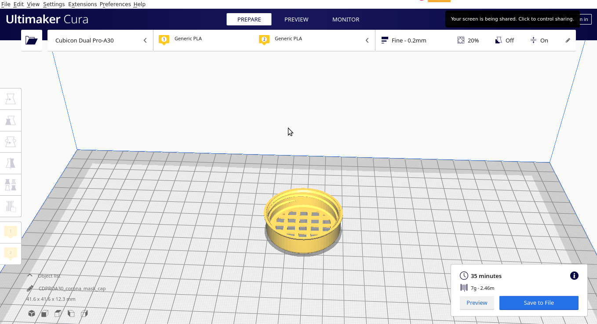

## COV3D mask

Author: Baisalbek Daniiarov

As breathing masks are scarce in times of Covid19, I thought it wouldn't hurt to design a 3D-printed version where the filters (e.g. cotton pads) can easily be replaced. The Blender project file is also included. By adjusting the splines, the mask can be adapted to different face shapes or sizes. I don't know how strong the filter effect will be with corona viruses. Independent of this, the mask is suitable for protection in e.g. woodwork ;) 

FILTER (not included)
This model only includes the mask structure (2 pieces: mask + cap) but does NOT include the required filter to effectively block inhalation of organic, chemical, physical particles (e.g. virus, bacteria).

For filter you can use one or more disks of reusable filtering materials, e.g. breathing filters, cotton, make-up pads, fabric, plaster/band-aid.
Note: each material has different filtering capabilities (density, resistance, etc.), therefore be sure to use the one that better fits your needs.
In addition, you can use single-use breathing masks to cut the filter out. You can get 8 to 10 disks out of a regular mask, thus reducing the consumption of those and contrasting the shortage of proper masks for the medical staff!
In order to cut the filters at the right size and shape, you can use the provided disk model.

You will also need two strings/bands/strips to wear the mask. In order to tight them you can use the provided block model (you'll need to print 4 copies of it).

## Print Settings

Rafts:
Doesn't Matter

Supports:
Yes

Resolution:
0.2 mm

Infill:
12%

Filament_brand:
Whatever

Filament_color:
Whatever

Filament_material:
PLA

